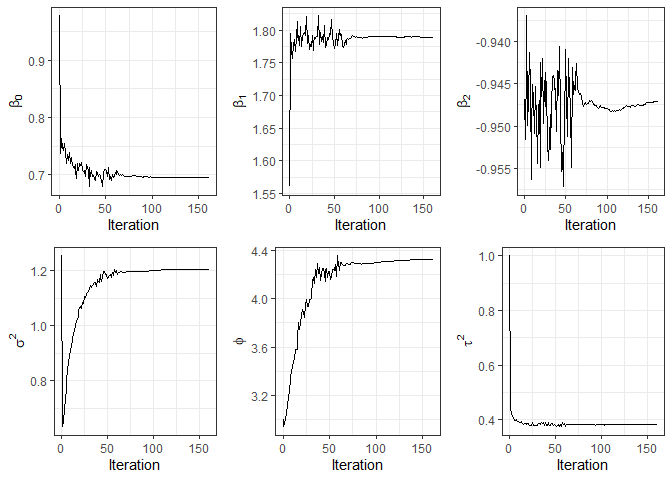

<!-- README.md is generated from README.Rmd. Please edit that file -->

## The `RcppCensSpatial` package

<!-- badges: start -->
<!-- badges: end -->

The `RcppCensSpatial` package fits a spatial censored linear regression
model using the Expectation-Maximization (EM) (Dempster, Laird, and
Rubin 1977), Stochastic Approximation EM (SAEM) (Delyon, Lavielle, and
Moulines 1999), or Monte Carlo EM (MCEM) (Wei and Tanner 1990)
algorithm. These algorithms are widely used to compute the maximum
likelihood (ML) estimates for incomplete data problems. The EM algorithm
computes the ML estimates when a closed expression for the conditional
expectation of the complete-data log-likelihood function is available.
In the MCEM algorithm, the conditional expectation is substituted by a
Monte Carlo approximation based on many independent simulations of the
partially observed data. In contrast, the SAEM algorithm splits the
E-step into simulation and integration steps.

This package also approximates the standard error of the estimates using
the method developed by Louis (1982) and supports missing values on the
dependent variable. Moreover, it has a function that performs spatial
prediction in new locations. It also allows computing the covariance
matrix and the distance matrix. For more information about the model
formulation and estimation, please see Ordoñez et al. (2018) and
Valeriano et al. (2021).

The `RcppCensSpatial` library provides the following functions:

-   `CovMat`: computes the spatial covariance matrix.
-   `dist2Dmatrix`: computes the Euclidean distance matrix for a set of
    coordinates.
-   `EM.sclm`: fits a spatial censored linear regression model via the
    EM algorithm.
-   `MCEM.sclm`: fits a spatial censored linear regression model via the
    MCEM algorithm.
-   `SAEM.sclm`: fits a spatial censored linear regression model via the
    SAEM algorithm.
-   `predict.sclm`: performs spatial prediction in a set of new
    locations.
-   `rCensSp`: simulates censored spatial data for an established
    censoring rate.

`print`, `summary`, `predict`, and `plot` functions also work for the
`sclm` class.

Next, we will describe how to install the package and use all the
previous methods in an artificial example.

### Installation

The released version of `RcppCensSpatial` from
[CRAN](https://CRAN.R-project.org) can be installed with:

``` r
install.packages("RcppCensSpatial")
```

### Example

In the following example, we simulate a dataset of length n = 220 from
the spatial linear regression model considering three covariates and the
exponential correlation function to deal with the variation between
spatial points. In order to evaluate the prediction accuracy, the
dataset is train-test split. The training data consists of 200
observations, with 5% censored to the left, while the testing data
contains 20 observations.

``` r
library(RcppCensSpatial)

set.seed(12341)
n = 220
x = cbind(1, runif(n), rnorm(n))
coords = round(matrix(runif(2*n, 0, 15), n, 2), 5)
dat = rCensSp(beta=c(1,2,-1), sigma2=1, phi=4, nugget=0.50, x=x, coords=coords,
              cens='left', pcens=.05, npred=20, cov.model="exponential")
# Proportion of censoring
table(dat$Data$ci)
#> 
#>   0   1 
#> 190  10
```

For comparison purposes, we fit the spatial censored linear model for
the simulated data using three approaches: EM, MCEM, and SAEM algorithm.
Each method considers the same maximum number of iterations
`MaxIter=300`, and the spatial correlation function used in the
simulation process, i.e., `type='exponential'`, the default value. Other
types of spatial correlation functions available are `'matern'`,
`'gaussian'`, and `'pow.exp'`.

``` r
data1 = dat$Data

# EM estimation
fit1 = EM.sclm(data1$y, data1$x, data1$ci, data1$lcl, data1$ucl, data1$coords, 
               phi0=3, nugget0=1, MaxIter=300)
fit1$tab
#>       beta0  beta1   beta2 sigma2    phi   tau2
#>      0.6959 1.7894 -0.9477 1.2032 4.3018 0.3824
#> s.e. 0.4848 0.2027  0.0592 0.5044 2.2872 0.0793

# MCEM estimation
fit2 = MCEM.sclm(data1$y, data1$x, data1$ci, data1$lcl, data1$ucl, data1$coords, 
                 phi0=3, nugget0=1, MaxIter=300, nMax=1000)
fit2$tab
#>       beta0  beta1   beta2 sigma2    phi   tau2
#>      0.6952 1.7896 -0.9476 1.2069 4.3216 0.3828
#> s.e. 0.4868 0.2025  0.0592 0.5121 2.3144 0.0793

# SAEM estimation
fit3 = SAEM.sclm(data1$y, data1$x, data1$ci, data1$lcl, data1$ucl, data1$coords, 
                 phi0=3, nugget0=1, M=10)
fit3$tab
#>       beta0  beta1   beta2 sigma2    phi   tau2
#>      0.6959 1.7883 -0.9471 1.2060 4.3207 0.3811
#> s.e. 0.4865 0.2021  0.0590 0.5096 2.3125 0.0791
```

Note that the estimates obtained for each parameter are similar and
close to the true parameter value, except for the first regression
coefficient, which was estimated close to 0.70, while the true value was
equal to 1.

Moreover, generic functions `print` and `summary` return some results of
the fit for the `sclm` class, such as the estimated parameters, standard
errors, the effective range, the information criteria, and some
convergence details.

``` r
print(fit3)
#> ----------------------------------------------------------------
#>            Spatial Censored Linear Regression Model   
#> ----------------------------------------------------------------
#> Call:
#> SAEM.sclm(y = data1$y, x = data1$x, ci = data1$ci, lcl = data1$lcl, 
#>     ucl = data1$ucl, coords = data1$coords, phi0 = 3, nugget0 = 1, 
#>     M = 10)
#> 
#> Estimated parameters:
#>       beta0  beta1   beta2 sigma2    phi   tau2
#>      0.6959 1.7883 -0.9471 1.2060 4.3207 0.3811
#> s.e. 0.4865 0.2021  0.0590 0.5096 2.3125 0.0791
#> 
#> The effective range is 12.9436 units.
#> 
#> Model selection criteria:
#>         Loglik     AIC     BIC
#> Value -251.323 514.645 534.435
#> 
#> Details:
#> Number of censored/missing values: 10 
#> Convergence reached?: TRUE 
#> Iterations: 161 / 300 
#> Processing time: 37.2335 secs
```

On the other hand, the function `plot` provides convergence graphics for
the parameters.

``` r
plot(fit3)
```



Now, we compute the predicted values for each fitted model for the
testing data and compare the mean squared prediction error (MSPE).

``` r
data2 = dat$TestData
pred1 = predict(fit1, data2$coords, data2$x)
pred2 = predict(fit2, data2$coords, data2$x)
pred3 = predict(fit3, data2$coords, data2$x)

# Cross-validation
mean((data2$y - pred1$predValues)^2)
#> [1] 1.595305
mean((data2$y - pred2$predValues)^2)
#> [1] 1.591421
mean((data2$y - pred3$predValues)^2)
#> [1] 1.594899
```

### References

<div id="refs" class="references csl-bib-body hanging-indent">

<div id="ref-delyon1999convergence" class="csl-entry">

Delyon, B., M. Lavielle, and E. Moulines. 1999. “Convergence of a
Stochastic Approximation Version of the EM Algorithm.” *The Annals of
Statistics* 27 (1): 94–128.

</div>

<div id="ref-dempster1977maximum" class="csl-entry">

Dempster, A. P., N. M. Laird, and D. B. Rubin. 1977. “Maximum Likelihood
from Incomplete Data via the EM Algorithm.” *Journal of the Royal
Statistical Society: Series B (Methodological)* 39 (1): 1–38.

</div>

<div id="ref-louis1982finding" class="csl-entry">

Louis, T. A. 1982. “Finding the Observed Information Matrix When Using
the EM Algorithm.” *Journal of the Royal Statistical Society: Series B
(Methodological)* 44 (2): 226–33.

</div>

<div id="ref-ordonez2018geostatistical" class="csl-entry">

Ordoñez, J. A., D. Bandyopadhyay, V. H. Lachos, and C. R. B. Cabral.
2018. “Geostatistical Estimation and Prediction for Censored Responses.”
*Spatial Statistics* 23: 109–23.
<https://doi.org/10.1016/j.spasta.2017.12.001>.

</div>

<div id="ref-valeriano2021likelihood" class="csl-entry">

Valeriano, K. L., V. H. Lachos, M. O. Prates, and L. A. Matos. 2021.
“Likelihood-Based Inference for Spatiotemporal Data with Censored and
Missing Responses.” *Environmetrics* 32 (3).

</div>

<div id="ref-wei1990monte" class="csl-entry">

Wei, G., and M. Tanner. 1990. “A Monte Carlo Implementation of the EM
Algorithm and the Poor Man’s Data Augmentation Algorithms.” *Journal of
the American Statistical Association* 85 (411): 699–704.
<https://doi.org/10.1080/01621459.1990.10474930>.

</div>

</div>
